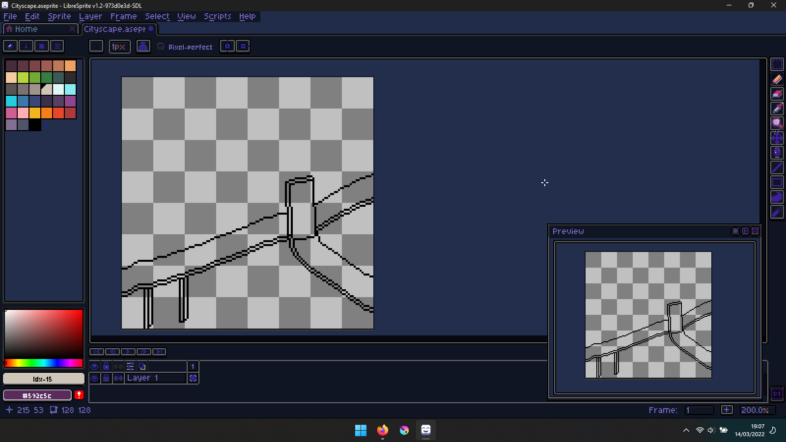

# PlueCells Theme for Libresprite
PlueCells Theme for Libresprite v1.0

## Installation
### 1. Download the zip file or clone the repository

### 2. Put it in your skin folder
Open LibreSprite.

Go to *Edit/Preferences/Theme*, you can see there are 2 paths at the top of the *Available Themes* list.

*For example on windows:*

> -- C:\Users\<your-username>\AppData\Roaming\Libresprite\data\skins\ --

> -- C:\Program Files\Libresprite\data\skins\ --

*or linux:*

> -- /home/<your-username>/.config/libresprite/data/skins/ --

> -- /tmp/.mount_LibreShxiPnk/usr/bin/data/skins/ -- (You should need be root user to modify this directory)

*or macOS:*

> -- /Users/<your-username>/Library/Application Support/LibreSprite/data/skins/ --  
  
Choose 1 of them then click *Open Folder*. Copy the file you've just downloaded here and extract it.

### 3. Apply theme
Open the *Preferences/Theme* dialog again, choose a theme from the list, click *Select* then click *OK*. Restart Libresprite to make the change happen.
  
## More Info on Libresprite Theming [here](https://github.com/LibreSprite/LibreSprite/blob/master/Theming.md)
